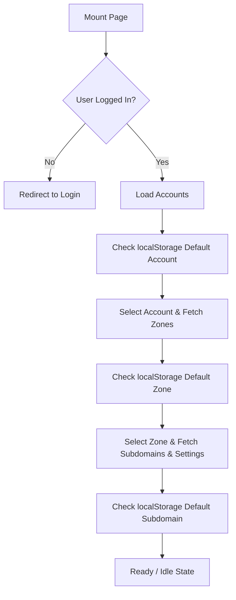

# Cloudflare API Integration & GraphQL Specification for GDCC Dashboard

This document details the workflow, API interaction design, and GraphQL query patterns used by the GDCC System (`app/systems/gdcc/page.js`) and its backend proxy endpoint (`app/api/scrape/route.js`). 

Use this document to understand the cascading configuration sequence, GraphQL queries, data mapping, and critical API constraints.

---

## 1. System Overview & Architecture

The GDCC Analytics system displays real-time and historical Cloudflare traffic data. It is constructed in two layers:
1. **Frontend (`app/systems/gdcc/page.js`):** Initiates requests, manages client-side authentication, loads defaults via `localStorage`, and processes raw metrics into charts and cards.
2. **Backend Proxy (`app/api/scrape/route.js`):** Directs traffic to Cloudflare’s GraphQL endpoint (`https://api.cloudflare.com/client/v4/graphql`) using the user’s Cloudflare API Token. It also queries and updates historical analytics from the local SQLite database (`sdb-cloudflare.db` via `lib/gdcc-db.js`).

---

## 2. Frontend Lifecycle & Dropdown Cascade

When a user accesses `/systems/gdcc`, the interface runs a strict cascading loading sequence:



### Cascading Actions:
* **Account Selection (`handleAccountChange`):** Clears downstream selections (Zone, Subdomain) and triggers `loadZones(token, accountId)`.
* **Zone Selection (`selectedZone` useEffect):** Resets Subdomain and triggers `loadDNSAndSettings()`.
* **Subdomain Selection (`selectedSubDomain` useEffect):** Resets older dashboard data to prevent showing stale stats.

### LocalStorage Scoping for Defaults:
Defaults are saved in `localStorage` scoped by the user’s ID (`currentUser.id`) to allow multi-user configurations:
* Account: `gdcc:dashboard:${userId}:accountId`
* Zone: `gdcc:dashboard:${userId}:zoneId`
* Subdomain: `gdcc:dashboard:${userId}:subdomain`

---

## 3. GraphQL Query Patterns & API Actions

The backend proxy `/api/scrape` handles two main GraphQL actions for traffic data:

### Action A: `get-traffic-analytics`
This is the core action for the GDCC Dashboard. It retrieves traffic throughput, top countries, top URLs, IP logs, and firewall event distributions.

#### ⚠️ CRITICAL QUERY CONSTRAINT (PLEASE READ)
> [!IMPORTANT]
> The query uses **`httpRequests1dGroups`** (aliased as `zoneSummary` in the payload) to retrieve aggregated daily traffic counts (Total Page Views, Uniques, Data Transfer, etc.).
> 
> **Constraint:** `httpRequests1dGroups` **does not support** subdomain host filtering (`clientRequestHTTPHost`).
> 
> **Why it fails:** If `clientRequestHTTPHost` is added inside the filter object of `httpRequests1dGroups`, the Cloudflare GraphQL API returns a validation error. Because Next.js parallelizes GraphQL sibling requests under one query document, **the entire response is invalidated**. This results in empty arrays (`[]`) for sibling datasets (`httpRequestsAdaptiveGroups`, `firewallEventsAdaptiveGroups`, etc.) while leaving the separate `fetchHostRequestTotal` query unaffected.
> 
> **Correct Pattern:** Leave `zoneSummary: httpRequests1dGroups` unfiltered by host, and rely on `httpRequestsAdaptiveGroups` (which supports `clientRequestHTTPHost`) to calculate specific subdomain traffic.

#### GraphQL Query Structure:
Depending on whether a subdomain is selected or not, the queries are split or merged. Below is the lightweight queries structure used when fetching subdomain-specific analytics:

##### 1. Subdomain Traffic Query:
```graphql
query GetSubdomainTraffic($zoneTag: String, $since: String, $until: String, $since_date: String, $until_date: String, $host: String) {
  viewer {
    zones(filter: { zoneTag: $zoneTag }) {
      # MUST NOT filter by clientRequestHTTPHost
      zoneSummary: httpRequests1dGroups(
        limit: 1, filter: { date_geq: $since_date, date_leq: $until_date }
      ) {
        sum { requests bytes cachedRequests cachedBytes pageViews }
        uniq { uniques }
      }
      httpRequestsAdaptiveGroups(
        filter: { datetime_geq: $since, datetime_leq: $until, clientRequestHTTPHost: $host }
        limit: 5000, orderBy: [count_DESC]
      ) {
        count avg { edgeTimeToFirstByteMs }
        dimensions {
          clientRequestHTTPHost clientIP clientRequestPath clientCountryName
          userAgent clientDeviceType userAgentOS edgeResponseStatus datetimeMinute
        }
      }
    }
  }
}
```

##### 2. Subdomain Firewall Query:
```graphql
query GetSubdomainFirewall($zoneTag: String, $since: String, $until: String, $host: String) {
  viewer {
    zones(filter: { zoneTag: $zoneTag }) {
      firewallActivity: firewallEventsAdaptiveGroups(
        filter: { datetime_geq: $since, datetime_leq: $until, clientRequestHTTPHost: $host }
        limit: 2000, orderBy: [datetimeMinute_ASC]
      ) { count dimensions { action datetimeMinute } }
      firewallRules: firewallEventsAdaptiveGroups(
        filter: { datetime_geq: $since, datetime_leq: $until, clientRequestHTTPHost: $host }
        limit: 200, orderBy: [count_DESC]
      ) { count dimensions { description ruleId source } }
      firewallIPs: firewallEventsAdaptiveGroups(
        filter: { datetime_geq: $since, datetime_leq: $until, clientRequestHTTPHost: $host }
        limit: 100, orderBy: [count_DESC]
      ) { count dimensions { clientIP clientCountryName action } }
      firewallSources: firewallEventsAdaptiveGroups(
        filter: { datetime_geq: $since, datetime_leq: $until, clientRequestHTTPHost: $host }
        limit: 100, orderBy: [count_DESC]
      ) { count dimensions { source action } }
    }
  }
}
```

### Action B: `get-traffic-raw-live`
Fetches a granular payload of traffic logs to populate charts on demand without historical database checks. It mirrors the `httpRequestsAdaptiveGroups` query structure.

---

## 4. UI Metric Processing

When the frontend receives the API response `result.data`, it computes and sets UI states inside `fetchAndApplyTrafficData`:

| UI Card Metric | Source Field in API Response | Computation Logic |
|---|---|---|
| **Total Requests** | `hostRequestTotal` or `totalReqLogs` | Uses `hostRequestTotal` (separate quick GraphQL query) as fallback when subdomain host request counts are empty. |
| **Avg Response Time** | `httpRequestsAdaptiveGroups` | `weightedAvgTime = Math.round(totalTimeSum / totalReqLogs)` where `totalTimeSum` is sum of `(edgeTimeToFirstByteMs * count)`. |
| **Blocked Events** | `firewallActivity` | Sum of event counts where `action !== 'log' && action !== 'skip' && action !== 'allow'`. |

### Charts Generation:
* **Traffic Volume (Throughput Chart):** Iterates over `httpRequestsAdaptiveGroups`, bins counts into time buckets based on date duration (e.g., 4-hour buckets for 24h+ ranges), and outputs to `throughputData`.
* **Attack Prevention History:** Iterates over `firewallActivity`, filters by mitigation actions (`block`, `challenge`, `js_challenge`, etc.), and bins into `attackSeriesData`.
* **Top Lists (URLs, Client IPs, Countries, User Agents):** Grouped dynamically by iterating over `httpRequestsAdaptiveGroups` and summing counts per dimension.
